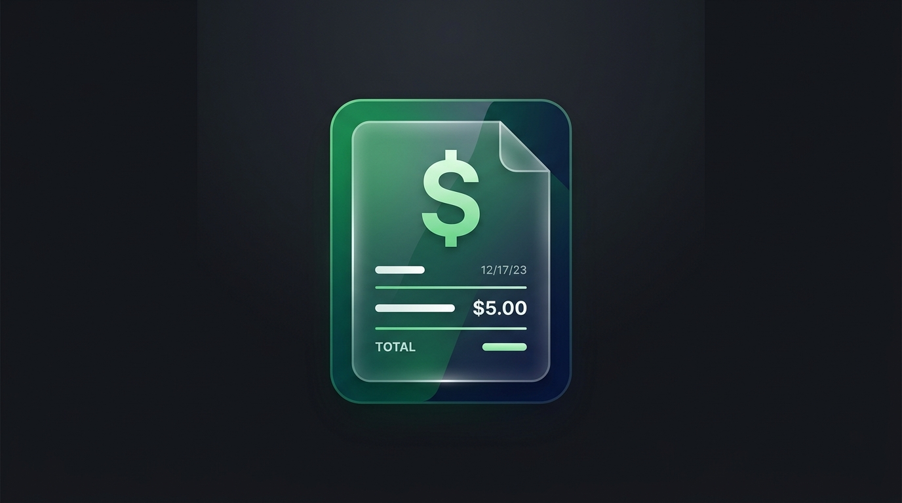

# 🧾 Bill-System (Invoicing & Financial Management)

A full-stack, enterprise-grade invoicing and billing system built with Next.js, TypeScript, and Tailwind CSS. Streamlines invoice generation, client records, tax calculations, and PDF financial exports.

---

## ✨ Features

- 📑 **Comprehensive Invoice Builder**: Add customized line items, quantity adjustments, tax calculations, and discount rules.
- 👥 **Client & Customer Directory**: Save and manage client profiles, contact information, and billing histories.
- 🖨️ **Print & PDF Export**: Instant client-ready PDF invoice generation with corporate branding.
- 📊 **Financial Dashboard**: Real-time revenue summaries, pending payment tracking, and status filtering (Paid, Pending, Overdue).
- 🎨 **Modern Glassmorphic UI**: High-contrast, responsive layout with dark/light mode support.

---

## 🛠️ Tech Stack

- **Framework**: Next.js (App Router), React 19
- **Language**: TypeScript
- **UI & Styling**: Tailwind CSS, Lucide Icons, Shadcn UI Components
- **State & Data**: Client-side state & local persistence

---

## 🚀 Quick Start

`ash
git clone https://github.com/Karthik751-MR/Bill-System.git
cd Bill-System/my-invoice-app
npm install
npm run dev
`

Visit http://localhost:3000 to access the billing dashboard.

---

## 👤 Author

- **Karthik** - [@Karthik751-MR](https://github.com/Karthik751-MR)
